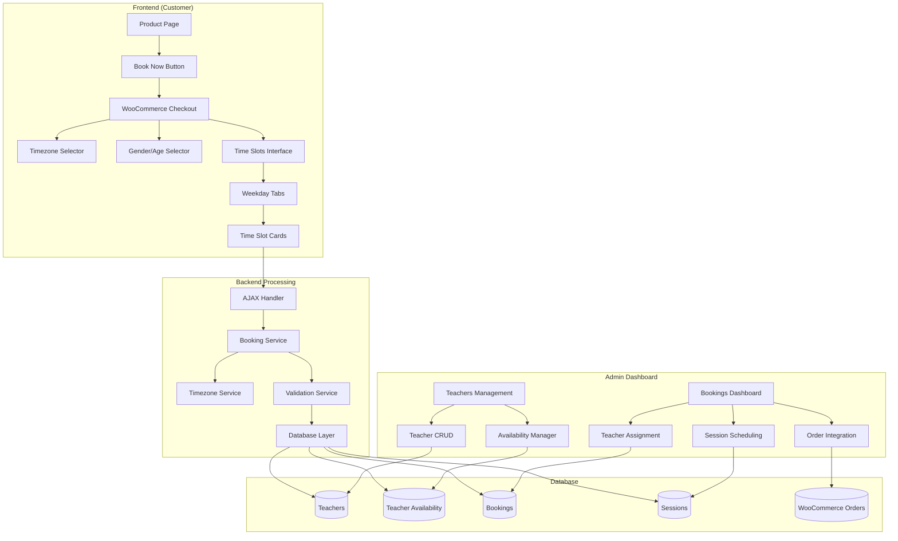

Perfect! Now I have a clear understanding of the requirements. Let me create a comprehensive development plan for the `hamdy-plugin`. Based on your answers, I understand that:

1. Customers can book multiple time slots in a single order
2. Admin manually assigns teachers after orders are placed
3. No automatic slot reservation - admin handles conflicts manually

Here's the detailed development plan:

## 1. Plugin Structure & File Organization

```
hamdy-plugin/
├── hamdy-plugin.php                 # Main plugin file
├── uninstall.php                    # Cleanup on uninstall
├── README.md                        # Documentation
├── includes/
│   ├── class-hamdy-plugin.php       # Main plugin class
│   ├── class-activator.php          # Plugin activation
│   ├── class-deactivator.php        # Plugin deactivation
│   ├── class-database.php           # Database operations
│   ├── models/
│   │   ├── class-teacher.php        # Teacher model
│   │   ├── class-time-slot.php      # Time slot model
│   │   └── class-booking.php        # Booking model
│   ├── services/
│   │   ├── class-timezone-service.php    # Timezone handling
│   │   ├── class-booking-service.php     # Booking logic
│   │   └── class-teacher-service.php     # Teacher management
│   └── utilities/
│       ├── class-validator.php      # Input validation
│       ├── class-sanitizer.php      # Data sanitization
│       └── class-time-helper.php    # Time/date utilities
├── admin/
│   ├── class-admin.php              # Admin interface controller
│   ├── pages/
│   │   ├── class-teachers-page.php  # Teachers management
│   │   ├── class-bookings-page.php  # Bookings management
│   │   └── class-settings-page.php  # Plugin settings
│   ├── partials/
│   │   ├── teacher-form.php         # Teacher add/edit form
│   │   ├── booking-list.php         # Bookings table
│   │   └── time-slots-manager.php   # Time slots interface
│   └── js/
│       ├── admin-teachers.js        # Teachers page JS
│       ├── admin-bookings.js        # Bookings page JS
│       └── time-slots.js            # Time slots management
├── public/
│   ├── class-public.php             # Frontend controller
│   ├── class-checkout-fields.php    # WooCommerce checkout integration
│   ├── class-ajax-handler.php       # AJAX endpoints
│   ├── partials/
│   │   ├── timezone-selector.php    # Timezone dropdown
│   │   ├── gender-selector.php      # Gender/age selection
│   │   ├── time-slots-tabs.php      # Weekday tabs
│   │   └── time-slot-cards.php      # Individual time slot cards
│   ├── js/
│   │   ├── checkout-booking.js      # Main checkout functionality
│   │   ├── timezone-handler.js      # Timezone conversion
│   │   └── time-slots-ui.js         # Time slots interaction
│   └── css/
│       ├── booking-styles.css       # Custom styles
│       └── tailwind-components.css  # Tailwind components
└── assets/
    ├── css/
    │   ├── admin-styles.css         # Admin dashboard styles
    │   └── public-styles.css        # Frontend styles
    ├── js/
    │   └── common.js                # Shared JavaScript
    └── images/
        └── icons/                   # UI icons
```

## 2. Database Schema Design

```sql
-- Teachers table
CREATE TABLE {prefix}hamdy_teachers (
    id bigint(20) unsigned NOT NULL AUTO_INCREMENT,
    user_id bigint(20) unsigned NOT NULL,
    name varchar(255) NOT NULL,
    email varchar(255) NOT NULL,
    gender enum('male','female') NOT NULL,
    can_teach_adults tinyint(1) DEFAULT 1,
    can_teach_children tinyint(1) DEFAULT 1,
    hourly_rate decimal(10,2) DEFAULT 0.00,
    status enum('active','inactive') DEFAULT 'active',
    created_at datetime DEFAULT CURRENT_TIMESTAMP,
    updated_at datetime DEFAULT CURRENT_TIMESTAMP ON UPDATE CURRENT_TIMESTAMP,
    PRIMARY KEY (id),
    KEY user_id (user_id),
    KEY status (status)
);

-- Teacher availability slots
CREATE TABLE {prefix}hamdy_teacher_availability (
    id bigint(20) unsigned NOT NULL AUTO_INCREMENT,
    teacher_id bigint(20) unsigned NOT NULL,
    day_of_week tinyint(1) NOT NULL, -- 0=Sunday, 1=Monday, etc.
    start_time time NOT NULL,
    end_time time NOT NULL,
    timezone varchar(50) DEFAULT 'UTC',
    is_active tinyint(1) DEFAULT 1,
    created_at datetime DEFAULT CURRENT_TIMESTAMP,
    PRIMARY KEY (id),
    KEY teacher_id (teacher_id),
    KEY day_of_week (day_of_week),
    FOREIGN KEY (teacher_id) REFERENCES {prefix}hamdy_teachers(id) ON DELETE CASCADE
);

-- Bookings table (linked to WooCommerce orders)
CREATE TABLE {prefix}hamdy_bookings (
    id bigint(20) unsigned NOT NULL AUTO_INCREMENT,
    order_id bigint(20) unsigned NOT NULL,
    product_id bigint(20) unsigned NOT NULL,
    customer_id bigint(20) unsigned NOT NULL,
    teacher_id bigint(20) unsigned NULL, -- Assigned by admin later
    customer_timezone varchar(50) NOT NULL,
    customer_gender enum('man','woman','child') NOT NULL,
    selected_slots longtext NOT NULL, -- JSON array of selected time slots
    booking_status enum('pending','confirmed','completed','cancelled') DEFAULT 'pending',
    admin_notes text,
    created_at datetime DEFAULT CURRENT_TIMESTAMP,
    updated_at datetime DEFAULT CURRENT_TIMESTAMP ON UPDATE CURRENT_TIMESTAMP,
    PRIMARY KEY (id),
    KEY order_id (order_id),
    KEY customer_id (customer_id),
    KEY teacher_id (teacher_id),
    KEY booking_status (booking_status),
    FOREIGN KEY (teacher_id) REFERENCES {prefix}hamdy_teachers(id) ON DELETE SET NULL
);

-- Scheduled sessions (individual time slots from bookings)
CREATE TABLE {prefix}hamdy_sessions (
    id bigint(20) unsigned NOT NULL AUTO_INCREMENT,
    booking_id bigint(20) unsigned NOT NULL,
    teacher_id bigint(20) unsigned NULL,
    session_date date NOT NULL,
    start_time time NOT NULL,
    end_time time NOT NULL,
    timezone varchar(50) NOT NULL,
    session_status enum('scheduled','completed','cancelled','rescheduled') DEFAULT 'scheduled',
    meeting_link varchar(500),
    notes text,
    created_at datetime DEFAULT CURRENT_TIMESTAMP,
    updated_at datetime DEFAULT CURRENT_TIMESTAMP ON UPDATE CURRENT_TIMESTAMP,
    PRIMARY KEY (id),
    KEY booking_id (booking_id),
    KEY teacher_id (teacher_id),
    KEY session_date (session_date),
    KEY session_status (session_status),
    FOREIGN KEY (booking_id) REFERENCES {prefix}hamdy_bookings(id) ON DELETE CASCADE,
    FOREIGN KEY (teacher_id) REFERENCES {prefix}hamdy_teachers(id) ON DELETE SET NULL
);
```

## 3. Major Components & Features

### Core Models
- **Teacher Model**: Manages teacher data, availability, and capabilities
- **Booking Model**: Handles customer bookings and order integration
- **TimeSlot Model**: Manages time slot data and availability logic
- **Session Model**: Individual scheduled sessions

### Services Layer
- **BookingService**: Core booking logic and validation
- **TeacherService**: Teacher management and assignment
- **TimezoneService**: Timezone conversion and handling
- **NotificationService**: Email/SMS notifications (future)

### Frontend Components
- **Checkout Integration**: WooCommerce checkout field injection
- **Time Slot Selector**: Interactive UI for slot selection
- **Timezone Handler**: Dynamic timezone conversion
- **AJAX Handler**: Real-time slot availability

### Admin Components
- **Teachers Management**: CRUD operations for teachers
- **Bookings Dashboard**: Order management and teacher assignment
- **Availability Manager**: Teacher schedule configuration
- **Reports**: Booking analytics and teacher performance

## 4. WordPress Hooks & APIs Integration

### WooCommerce Hooks
```php
// Checkout page integration
add_action('woocommerce_checkout_before_order_review', 'add_booking_fields');
add_action('woocommerce_checkout_process', 'validate_booking_fields');
add_action('woocommerce_checkout_update_order_meta', 'save_booking_data');

// Order completion
add_action('woocommerce_order_status_completed', 'create_booking_record');
add_action('woocommerce_order_status_cancelled', 'cancel_booking');

// Product page integration
add_action('woocommerce_single_product_summary', 'add_book_now_button', 25);
```

### WordPress Core Hooks
```php
// Admin menu and pages
add_action('admin_menu', 'register_admin_pages');
add_action('admin_enqueue_scripts', 'enqueue_admin_assets');

// Frontend assets
add_action('wp_enqueue_scripts', 'enqueue_public_assets');

// AJAX endpoints
add_action('wp_ajax_get_available_slots', 'handle_get_available_slots');
add_action('wp_ajax_nopriv_get_available_slots', 'handle_get_available_slots');

// Database operations
register_activation_hook(__FILE__, 'create_plugin_tables');
register_deactivation_hook(__FILE__, 'cleanup_plugin_data');
```

### Custom Hooks for Extensibility
```php
// Allow other plugins to modify booking data
do_action('hamdy_before_booking_save', $booking_data);
do_action('hamdy_after_booking_created', $booking_id);

// Teacher assignment hooks
do_action('hamdy_teacher_assigned', $booking_id, $teacher_id);
do_action('hamdy_session_scheduled', $session_id);
```

## 5. Frontend vs Backend Responsibilities

### Frontend (Public)
- **Checkout Integration**: Inject booking fields into WooCommerce checkout
- **Time Slot Selection**: Interactive UI for selecting available slots
- **Timezone Handling**: Convert and display times in user's timezone
- **Real-time Updates**: AJAX calls for slot availability
- **Form Validation**: Client-side validation before submission

### Backend (Admin)
- **Teacher Management**: CRUD operations for teachers and availability
- **Booking Management**: View, assign teachers, manage bookings
- **Order Integration**: Link bookings to WooCommerce orders
- **Session Scheduling**: Create individual sessions from bookings
- **Reporting**: Analytics and performance tracking

### Shared Responsibilities
- **Data Validation**: Both client and server-side validation
- **Security**: Nonces, sanitization, and permission checks
- **Caching**: Transients for frequently accessed data
- **Logging**: Error tracking and debugging information

## 6. Reusable Utility Modules

### Time & Timezone Utilities
```php
class TimeHelper {
    public static function convertToUserTimezone($utc_time, $user_timezone);
    public static function getAvailableTimezones();
    public static function formatTimeForDisplay($time, $format);
    public static function generateTimeSlots($start, $end, $interval);
}
```

### Validation & Sanitization
```php
class Validator {
    public static function validateTimezone($timezone);
    public static function validateTimeSlot($slot_data);
    public static function validateBookingData($booking_data);
}

class Sanitizer {
    public static function sanitizeBookingData($data);
    public static function sanitizeTimeSlot($slot);
    public static function sanitizeTeacherData($teacher_data);
}
```

### Database Abstraction
```php
class DatabaseHelper {
    public static function insertBooking($booking_data);
    public static function updateBookingStatus($booking_id, $status);
    public static function getAvailableTeachers($criteria);
    public static function getBookingsByStatus($status);
}
```

## 7. Phased Implementation Plan

### Phase 1: Core Foundation (Week 1-2)
**Deliverables:**
- Plugin structure and main files
- Database schema creation
- Basic models (Teacher, Booking, TimeSlot)
- Plugin activation/deactivation hooks

**Key Files:**
- [`hamdy-plugin.php`](hamdy-plugin.php:1)
- [`includes/class-hamdy-plugin.php`](includes/class-hamdy-plugin.php:1)
- [`includes/class-database.php`](includes/class-database.php:1)
- [`includes/models/`](includes/models/:1) classes

### Phase 2: Admin Dashboard (Week 2-3)
**Deliverables:**
- Teachers management interface
- Teacher availability configuration
- Basic settings page
- Admin menu integration

**Key Files:**
- [`admin/class-admin.php`](admin/class-admin.php:1)
- [`admin/pages/class-teachers-page.php`](admin/pages/class-teachers-page.php:1)
- [`admin/partials/teacher-form.php`](admin/partials/teacher-form.php:1)

### Phase 3: Frontend Booking UI (Week 3-4)
**Deliverables:**
- WooCommerce checkout integration
- Timezone selector component
- Gender/age selection interface
- Time slots display (tabs and cards)

**Key Files:**
- [`public/class-checkout-fields.php`](public/class-checkout-fields.php:1)
- [`public/partials/`](public/partials/:1) components
- [`public/js/checkout-booking.js`](public/js/checkout-booking.js:1)

### Phase 4: Booking Logic & AJAX (Week 4-5)
**Deliverables:**
- Time slot availability calculation
- AJAX endpoints for real-time updates
- Booking data validation and storage
- Order meta integration

**Key Files:**
- [`public/class-ajax-handler.php`](public/class-ajax-handler.php:1)
- [`includes/services/class-booking-service.php`](includes/services/class-booking-service.php:1)
- [`public/js/time-slots-ui.js`](public/js/time-slots-ui.js:1)

### Phase 5: Booking Management (Week 5-6)
**Deliverables:**
- Admin bookings dashboard
- Teacher assignment interface
- Session scheduling system
- Order status integration

**Key Files:**
- [`admin/pages/class-bookings-page.php`](admin/pages/class-bookings-page.php:1)
- [`admin/partials/booking-list.php`](admin/partials/booking-list.php:1)
- [`includes/models/class-booking.php`](includes/models/class-booking.php:1)

### Phase 6: Styling & UX Polish (Week 6-7)
**Deliverables:**
- Tailwind CSS integration
- Responsive design implementation
- UI/UX improvements
- Cross-browser testing

**Key Files:**
- [`public/css/tailwind-components.css`](public/css/tailwind-components.css:1)
- [`assets/css/`](assets/css/:1) files
- JavaScript enhancements

### Phase 7: Testing & Optimization (Week 7-8)
**Deliverables:**
- Comprehensive testing
- Performance optimization
- Security audit
- Documentation completion

## 8. Technical Architecture Diagram



This comprehensive plan provides a solid foundation for building the `hamdy-plugin` with clear separation of concerns, scalable architecture, and phased implementation approach. The modular structure allows for easy maintenance and future enhancements.

Would you like me to proceed with implementing this plan, or would you like to discuss any modifications to the architecture or implementation approach?

I've created a comprehensive development plan for the `hamdy-plugin` WordPress plugin that implements one-to-one live course booking functionality. Here's what the plan includes:

## Complete Plugin Architecture

**1. Structured File Organization**
- Modular plugin structure with `includes/`, `admin/`, `public/`, and `assets/` directories
- Separation of models, services, and utilities for maintainable code
- WordPress coding standards compliance

**2. Database Schema Design**
- 4 custom tables: teachers, teacher availability, bookings, and sessions
- Proper foreign key relationships and indexing
- Support for timezone handling and booking status tracking

**3. Major Components & Features**
- **Frontend**: WooCommerce checkout integration with timezone selector, gender/age selection, and interactive time slot cards with weekday tabs
- **Backend**: Admin dashboard for teacher management, booking oversight, and session scheduling
- **Services**: Booking logic, teacher assignment, and timezone conversion utilities

**4. WordPress Integration Strategy**
- WooCommerce hooks for checkout integration and order processing
- WordPress admin hooks for dashboard pages and asset management
- AJAX endpoints for real-time slot availability updates
- Custom hooks for extensibility

**5. Technical Implementation Details**
- Multiple time slots per order support
- Admin-managed teacher assignment workflow
- No automatic slot reservation (admin handles conflicts)
- Tailwind CSS for modern UI components
- Comprehensive validation and sanitization

**6. 7-Phase Implementation Plan**
- **Phase 1**: Core foundation and database setup
- **Phase 2**: Admin dashboard and teacher management
- **Phase 3**: Frontend booking UI components
- **Phase 4**: Booking logic and AJAX functionality
- **Phase 5**: Booking management and teacher assignment
- **Phase 6**: Styling and UX polish with Tailwind CSS
- **Phase 7**: Testing, optimization, and documentation

**7. Reusable Utility Modules**
- Time and timezone handling utilities
- Validation and sanitization helpers
- Database abstraction layer
- Security and performance optimizations

The plan includes a detailed Mermaid diagram showing the system architecture flow from customer booking through admin management to database storage. All components are designed to work seamlessly with the existing Eduma theme, LearnPress plugin, and WooCommerce integration while maintaining WordPress best practices for security, performance, and extensibility.

This architecture provides a solid foundation for building a professional-grade booking system that can handle the complexity of one-to-one live course scheduling while remaining maintainable and scalable.